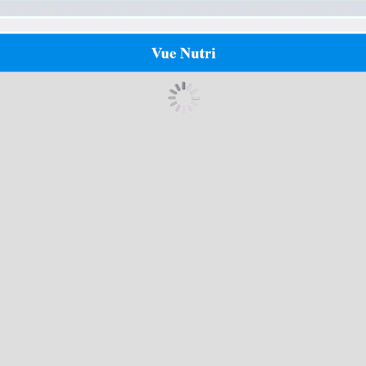

<div align="center">

</div>

### Integração com API
Projeto para práticar [vueJS](https://cli.vuejs.org/), uma aplicação simples que faz comunicação com API REST. 

### Get started
```
# Instale todas as dependências:
$ npm install

# Para desenvolvimento:
$ npm run serve

# Para produção:
$ npm run build
```

### Tecnologias

* Vue
* Axios
* Javascript